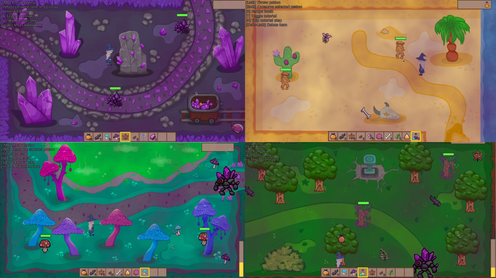
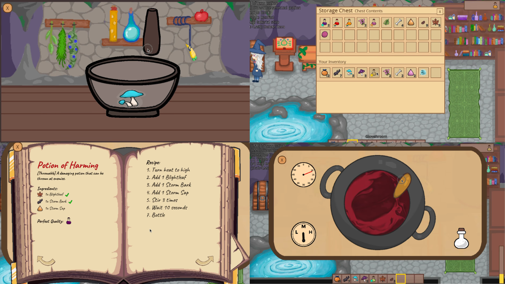

# Enchanted Grotto
You are an Alchemist and your Grotto is in peril

An evil force has taken over and poisoned your home, sending 3 guardians that prevent entry to neighbouring lands.

Reclaim your land by brewing potions to vanquish the guardians. Work your way up to brew a Potion of Rejuvenation that will save your grotto!

## Demos
Trailer: https://youtu.be/KmS6YK-sk_k

Full playthrough: https://youtu.be/lGuZiGV9tXE \
Tutorial playthrough: https://youtu.be/csoMpcM58eU

Itch.io Link: https://skyleapa.itch.io/enchanted-grotto




## Controls
- *WASD*: Move around
- *F*: Most interactions
- *R*: Open/Close recipe book
- *Left Click*: Throw a potion that you have selected in your inventory (only if potion is throwable). Rearrange inventory and chest
- *Right Click*: Consume a potion that you have selected in your inventory (only if potion is consumable)
- *0-9*: Select a inventory slot

### Tutorial
- *N*: Advance to the next step of the current tutorial
- *T*: Toggle the tutorial on/off. Toggling it on will restart at the beginning of the tutorial

### Save/Load
- *P*: Save your current game (works only if you haven't used *M* below)
- *L*: Restart your game and create a fresh save file
- *M*: Takes over your current save state with a UNLOCKED state, giving you access to all 11 potions in the game (1 potion in the chest). Closing the game will not save any progress you make, and will reload your most recently saved state

## Build & Run Instructions
Both systems take in a `game|test` argument:
- `game` builds and runs the full game
- `test` builds and runs tests for item serialization and potion comparison mechanics
- If no arguments are supplied, the scripts default to `game`

### Windows:
```bash
.\run [game|test]
```

Note that on some Windows configurations, CMake may place the game executable in the `/build/Debug` folder. If the script fails, the executable is most likely there and can be run directly.

### Linux/macOS:
Requires `freetype` to be installed. On macOS, use `brew install freetype`.
```bash
chmod +x run.sh
./run.sh [game|test]
```

## Credits

Corina Dong \
	- Mortar and pestle menu, guardian interactions, item pickups, enemy AI \
	- Art Assets: Ingredients, guardians, enemies, menus

Leo Fang \
	- Potion system, potion qualities, corruption fog and cauldron water shaders, mouse gestures \
	- LottieUI and RmlUI integration

Michelle Wang \
	- Collision (box and meshed), rendering, tutorial/animations, potion effects \
	- Art Assets: Character, environments, enemies, grotto, player animation

Stephanie Ho \
	- Combat, potion effects and throwing/consuming, tutorial/animations, biome changing \
	- Sound design

Victor Vannara \
	- Save/Load serialization, chest and inventory system, recipe book, item global timers \
	- LottieUI and RmlUI integration

Darryl Tanzil: Trailer Video Editor